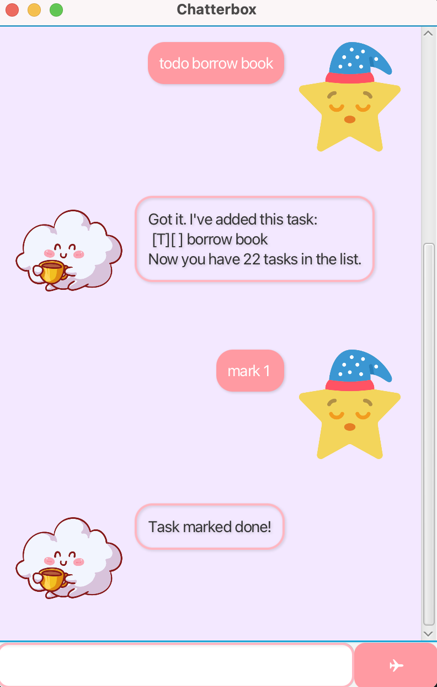

# Chatterbox User Guide


Meet Chatterbox!
Love typing and getting things done?
Chatterbox is your new command-line productivity companion!
Chatterbox helps you stay organised through natural, simple to remember and intuitive commands!


## Adding todos: `todo`
Adds a todo task to the task list.
Format: todo INDEX
Example: `todo borrow book`
Example Output:
```
Got it. I've added this task:
[T][ ] Read Book
Now you have 1 tasks in the list.
```

## Adding deadlines: `deadline`
Adds a deadline task to the task list.
Format: deadline DESCRIPTION /by dd/mm/yy HhMm
Example: `deadline return book /by 17/09/2025 1800`
Example Output:
```
Got it. I've added this task:
[D][ ] return book (by: Sep 17 2025 18:00)
Now you have 2 tasks in the list.
```

## Adding events: `event`

Adds an event task to the task list with a start and end date/time.
Format: event DESCRIPTION /from dd/mm/yy HhMm /to dd/mm/yy HhMm
Example:  
`event team meeting /from 17/09/2025 1400 /to 17/09/2025 1500`
Example Output:
```
Got it. I've added this task:
[E][ ] team meeting (from: Sep 17 2025 14:00 to: Sep 17 2025 15:00)
Now you have 3 tasks in the list.
```

## Marking tasks as complete: `mark`
Mark a task as complete based on index in task list.
Format: mark INDEX
Example: `mark 1`
Example Output:
```
Task marked done!
```

## Marking tasks as incomplete: `unmark`
Mark a task as incomplete based on index in task list.
Format: unmark INDEX
Example: `unmark 1`
Example Output:
```
Task unmarked!
```

## Deleting tasks: `delete`
Deletes a task from the task list by index.
Format: delete INDEX
Example: `delete 1`
Example Output:
```
Task deleted!
```


## Searching tasks: `find`
Find tasks containing specific keywords.
Format: find DESCRIPTION
Example: `find book`
Example Output:
```
Here are the matching tasks in your list:
[T][ ] borrow book
[D][ ] return book (by: 2025-08-24)
```

## Undoing actions: `undo`
Reverts the last action performed.
Format: undo 
Example: `undo`
Example Output:
```
Last action undone!
```

## Closing Chatterbox: `bye`
Closes the chatbot.
Format: bye
Example: `bye`
Example Output:
```
Bye. Hope to see you again soon!
```


